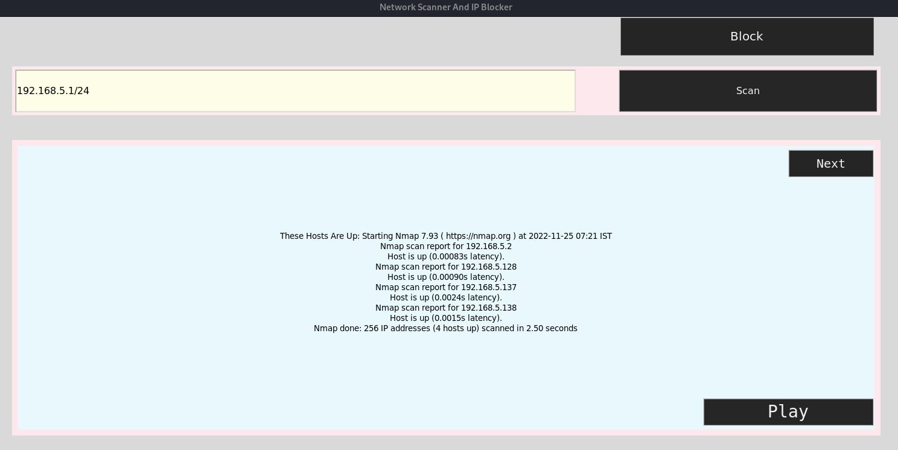
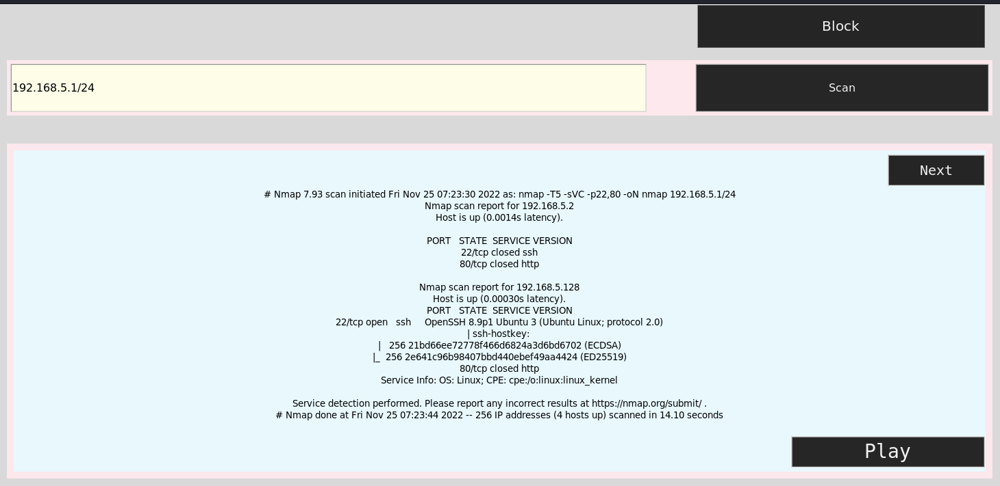
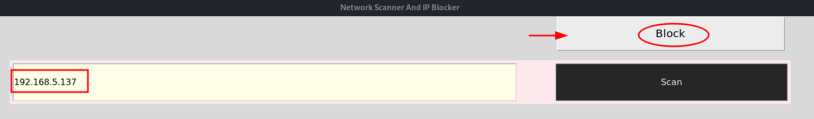
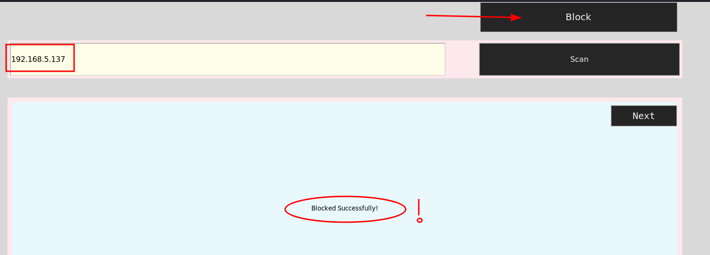

# Internal Firewall Management System<br />

---------------
## Usability : <br />

> I basically created a nat subnet mask by cloning three ubuntu vm's in my vmware and kali as main network.<br />

> This project is basically like your own Internal Network Scanner and also act as an IP Blocker when needed (:<br />

> It got a basic design as you what you'll expect from tkinter library and this is also my first time every programming something in python, but it was hella<br />        
  interesting ride mates learned a lot along the way and guess what python is so awesome with it's libraries :shipit: <br />

`Let's do the basic ping scan first by just giving the subnet mask upto how many ips you can even scan the whole network together Just hit the scan button: `<br/>



```
as You See Mates Pretty Quickly it Shows you all the live hosts on your network: 

1. 192.168.5.137
2. 192.168.5.138
3. 192.168.5.2
4. 192.168.5.128
```
---------------

### Now If You Wana Scan furthur for the Ip's Info Just Hit `Next Button` : <br />

> Now By default it'll again scan the whole subnet for services and os info, so it'll take some time <br />



```
Now Just look at the information it's crazy right and its handy to just get to know what devies are connected to your network and what them devices are running on , you can also see the ports that are open in those network ips and the services running on those ports .

As in here you can see -

port 22 is running ssh on ip: 192.168.5.128
port 80 is running an http server on ip: 192.168.5.137
```
---------------

### Now comes the Blocking Part Just Type The Ip you want to Block From The Network and Hit `Block Button`: <br />



<br />

> It'll dropped outta your network and i used `iptables` to do that, you could've also used `ufw` but that wouldn't make a lot of difference here as it's just<br/>
  blocking one ip.

> `ufw` is also based on `iptables` but it comes with its own rules (;<br />

---------------
## Capture Of A Sad Moment For Us Hackers : <br />




<br/>

`Thank You , Vamos!! :shipit:`
