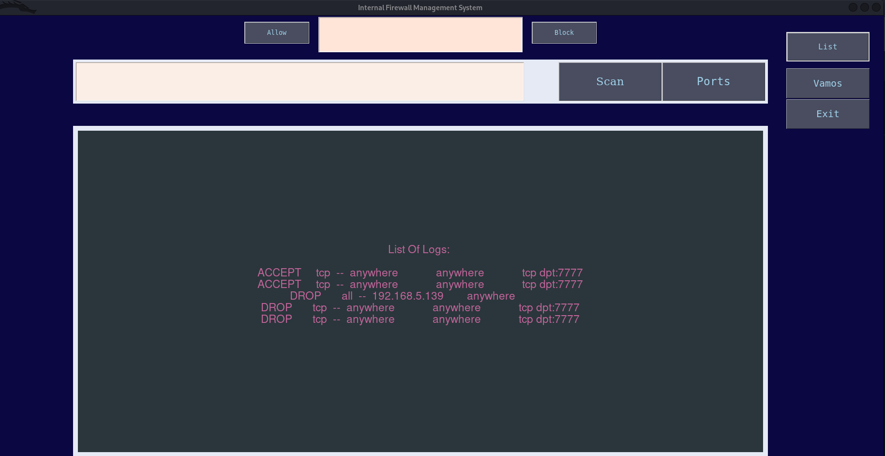

# Internal Firewall Management System<br />

---------------
## Usability : <br />

> I basically created an internal network using a kali vm, a ubuntu vm, and windows in my vmware and kali as admin in the network.<br />

> This project is basically like your own Internal Network Scanner and also act as an IP Blocker when needed (:<br />

> It got a basic design as what you'll expect from tkinter library and this is also my first time ever programming something in python, but it was hella<br />        
  interesting ride mates learned a lot along the way and guess what python is so awesome with it's libraries :shipit: <br />

`Let's do the basic ping scan first by just giving the subnet mask upto how many ips you wana scan together Just hit the scan button: `<br/>


```
as You See Mates Pretty Quickly it Shows you all the live hosts on the same network as yours: 

1. 192.168.5.1
2. 192.168.5.128
3. 192.168.5.139
```
---------------

### Now If You Wana Scan furthur for the Ip's Info Just Hit `Port Button` : <br />

> Now By default it'll again scan the whole subnet you entered in the entry field - for services and os info. <br />


```
Now Just look at the information it's crazy right and its handy to just get to know what devies are connected to your network and what them devices are running on , you can also see the ports that are open in those network ips and the services running on those ports .

As in here you can see -

some default window ports open on ip: 192.168.5.1
port 777 and port 80 is open on ip: 192.168.5.139
port 53 open on ip: 192.168.5.2 its as default as for dns
nothing is opened on our kali until you hit the vamos! as it'll open port 7777 for incoming connections
```
---------------

### Now comes the Blocking Part Just Type The Ip you want to Block From The Network and Hit `Block Button`: <br />


> If You run the ping scan again, you can see the ip is gone from your network.. <br />

> The specified ip will be dropped outta your network and i used `iptables` to do that, you could've also used `ufw` but that wouldn't make a lot of difference here as it's just blocking one ip.<br />

> `ufw` is also based on `iptables` but it comes with its own rules (;<br />

---------------
### Allowing An Ip Back: <br  />

> There's always a chance that you blocked a wrong device from network and want to unblock it, so just click Allow Button <br />


----------------

### Starting A File Upload Server: <br />

> If You wana Keep an Ip Blocked but just want to give it access to just simply share some files over the network, well you can by clicking `Vamos`<br />


> Now You can go to the other machine and check if you can access the server and can transfer files over it (: <br />


> I took a screenshot and uploaded it on the server and you can see i got it here...<br />

> For the server to work properly you need to make an uploads folder in your `/var/www/html` directory and copy the code files from `Server` Folder in repo.<br />


<br />

> After the file sharing you can just close the server by hitting `Exit` Button<br />


---------------
### Checking The Logs: <br />

> You can also check the logs of rules you added to your firewall, by clicking `List` button<br />


<br />
--------------
> Don't forget to add your linux password in place of password in `main.py`<br />
---------------
#### Capture Of A Sad Moment For Us Hackers : <br />


<br/>

`Thank You , Vamos!!` :shipit:
